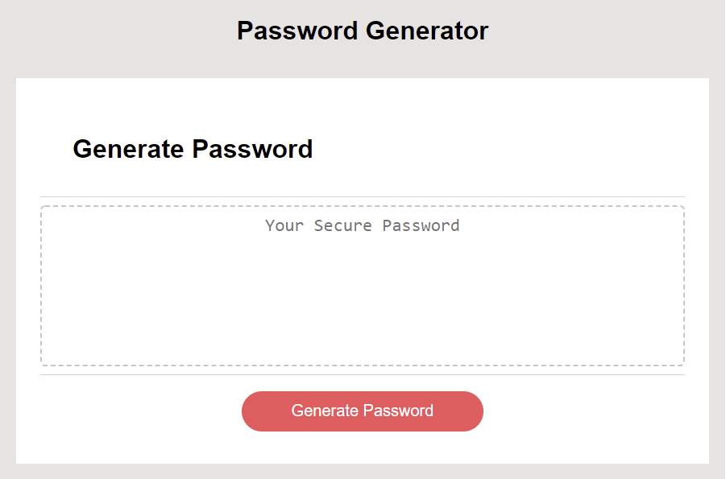
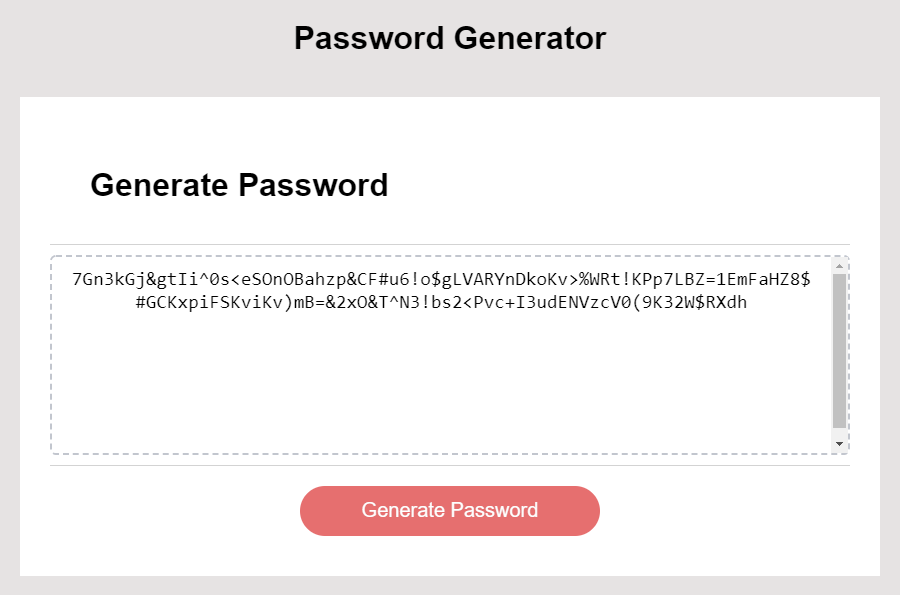

# Password Generator

## User Story

```
AS AN employee with access to sensitive data
I WANT to randomly generate a password that meets certain criteria
SO THAT I can create a strong password that provides greater security
```
## Page Functionality
    Generates password that's between 8-128 characters long
    Ask different questions to determine what characters make up the password
    Resets and creates new password whenever the "Generate Password" button is clicked
    Follows the acceptance criteria
    


## Work

* The URL of the deployed application: https://rob-watson-84.github.io/password-generator/

* The URL of the GitHub repository: https://github.com/Rob-Watson-84/password-generator




---